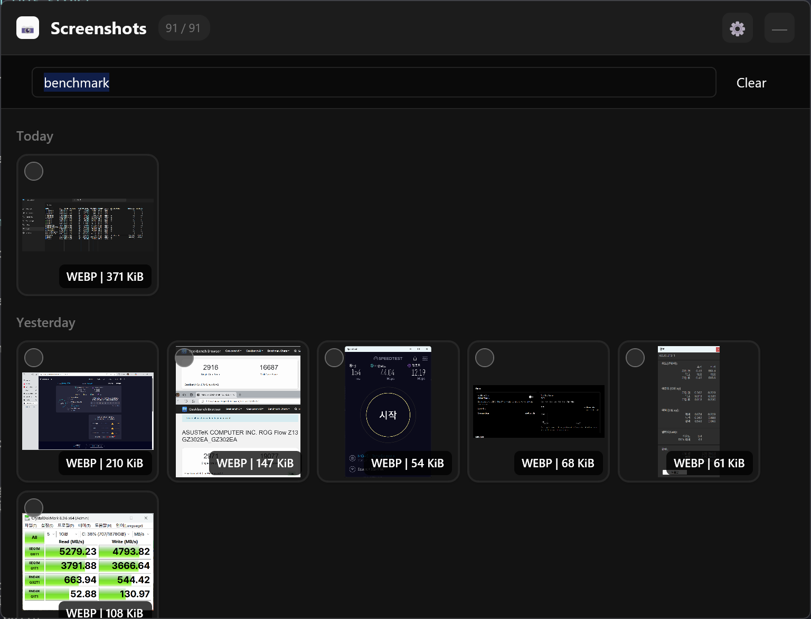

# Sukusho (スクショ)

A powerful screenshot manager for Windows with AI-powered semantic search. Lives in your system tray, inspired by [Screenie](https://www.screenie.io/) for macOS.



## Features

### Core Features

- **System Tray Integration** - Runs quietly in your system tray, always ready when you need it
- **Global Hotkey** - Toggle the window with a customizable keyboard shortcut (default: `Ctrl+Shift+S`)
- **GPU-Accelerated UI** - Built with [GPUI](https://gpui.rs/) (Zed's UI framework) for smooth, responsive performance
- **Thumbnail Gallery** - Beautiful grid view with adjustable thumbnail sizes and infinite scroll
- **Drag & Drop** - Drag screenshots directly into other applications
- **Multi-Select** - Select multiple items with checkboxes, Ctrl+Click, or Shift+Click
- **Native Context Menu** - Right-click for Windows shell context menu (Open, Copy, Delete, etc.)
- **Clipboard Support** - Copy selected files with `Ctrl+C`

### Smart Organization

- **Auto-Organizer** - Automatically organize screenshots into date-based folders
- **Customizable Format** - Choose your own date format (YYYY-MM-DD, YYYY/MM/DD, etc.)
- **Manual Organization** - Organize existing screenshots with progress tracking

### Image Processing

- **Auto-Convert** - Automatically convert PNG screenshots to WebP or JPEG to save space
- **Quality Control** - Adjustable compression quality (1-100)
- **Batch Convert** - Convert multiple existing files at once

### AI-Powered Search (Experimental)

- **Semantic Search** - Find screenshots by describing what's in them (e.g., "cat", "sunset", "code")
- **100% Local Processing** - All AI runs on your machine, no internet connection needed after model download
- **Fast & Private** - Uses prewarmed models for instant results, your screenshots never leave your PC
- **Vector Database** - Powered by LanceDB for efficient similarity search
- **Auto-Indexing** - New screenshots are automatically indexed for search

## Installation

### From Source

```bash
# Clone the repository
git clone https://github.com/ssut/sukusho.git
cd sukusho

# Build release version
cargo build --release

# Run
./target/release/sukusho.exe
```

### Requirements

- Windows 10/11
- Rust 1.75+ (uses edition 2024)

## Usage

### Basic Controls

| Action                 | Description                             |
| ---------------------- | --------------------------------------- |
| **Left Click (Tray)**  | Toggle window visibility                |
| **Right Click (Tray)** | Open tray menu                          |
| **Global Hotkey**      | Toggle window (default: `Ctrl+Shift+S`) |
| **ESC**                | Minimize window                         |
| **Ctrl+C**             | Copy selected files to clipboard        |
| **Ctrl+A**             | Select all visible screenshots          |
| **Double Click**       | Open screenshot with default app        |
| **Right Click**        | Show context menu                       |

### Selection

- **Click checkbox** - Toggle selection (multi-select)
- **Click item** - Select single item
- **Ctrl+Click** - Add/remove from selection
- **Shift+Click** - Range selection

### Drag & Drop

Select one or more screenshots and drag them directly into:

- File Explorer
- Email clients
- Chat applications (Slack, Discord, etc.)
- Image editors
- Any application that accepts files

## Settings

Access settings by clicking the gear icon (⚙) in the header.

### General

- **Screenshot Directory** - Folder to watch for new screenshots
- **Thumbnail Size** - Adjust grid thumbnail size (80-300px)
- **Grid Columns** - Adjust number of columns in gallery view

### Organizer

- **Enable Auto-Organize** - Automatically organize new screenshots into date-based folders
- **Date Format** - Choose your preferred folder naming format (YYYY-MM-DD, YYYY/MM/DD, etc.)
- **Organize Existing** - Manually organize all existing screenshots with progress tracking

### Conversion

- **Auto-convert Screenshots** - Automatically convert new PNG files
- **Conversion Format** - Choose WebP or JPEG
- **Quality** - Image quality (1-100)
- **Batch Convert** - Convert all existing PNG files at once

### Image Indexing & Search (Experimental)

- **Enable Image Indexing** - Turn on AI-powered semantic search
- **Download Models** - First-time setup downloads ~150MB of AI models (one-time)
- **CPU Mode** - Choose between Normal (balanced) or Fast (max performance)
- **Manual Indexing** - Index all existing screenshots or just new ones
- **Search** - Use the search bar at the top to find screenshots by describing their content

> **Privacy Note**: All AI processing happens locally on your machine. No screenshots or data are sent to external servers. After initial model download, no internet connection is required.

### Hotkey

- **Enable Global Hotkey** - Toggle hotkey functionality
- **Current Hotkey** - View/record new hotkey combination

## Configuration

Settings are stored in:

```
%APPDATA%\sukusho\settings.json
```

Default screenshot directory:

```
%USERPROFILE%\Pictures\Screenshots
```

## Debug Mode

Run with console output for debugging:

```bash
sukusho.exe --console
```

Logs are written to `sukusho_debug.log` in the current directory.

## Tech Stack

- **[GPUI](https://gpui.rs/)** - GPU-accelerated UI framework from Zed
- **[gpui-component](https://github.com/longbridge/gpui-component)** - UI component library
- **[tray-icon](https://github.com/tauri-apps/tray-icon)** - System tray support
- **[global-hotkey](https://github.com/tauri-apps/global-hotkey)** - Global keyboard shortcuts
- **[notify](https://github.com/notify-rs/notify)** - File system watching
- **[image](https://github.com/image-rs/image)** - Image processing

## Building

```bash
# Debug build
cargo build

# Release build (optimized)
cargo build --release

# Run tests
cargo test
```

## License

MIT License - see [LICENSE](LICENSE) for details.

## Acknowledgments

- Inspired by [Screenie](https://www.screenie.io/) for macOS
- Built with [GPUI](https://gpui.rs/) by the [Zed](https://zed.dev/) team
- UI components from [gpui-component](https://github.com/longbridge/gpui-component)
